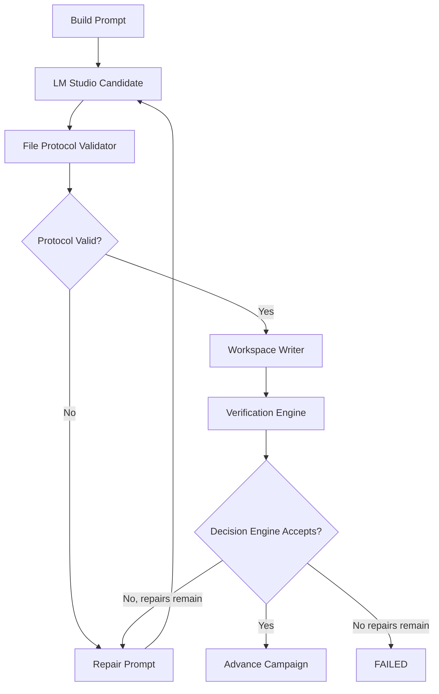

# Campaign Runner Architecture

Campaign Runner owns execution. LM Studio only generates candidate artifacts.

## Execution Engine

File: `app/lib/execution-engine.ts`

Public interface:

```ts
executeNextHour(projectRoot: string): Promise<RunResult>
```

Flow:



Example log lines:

```text
[2026-06-25T08:00:00.000Z] PROMPT_BUILT: Hour 01 prompt hash abc123.
[2026-06-25T08:00:05.000Z] PROTOCOL_REJECTED: Model response did not include any FILE: relative/path blocks.
[2026-06-25T08:00:20.000Z] CAMPAIGN_ADVANCED: Hour 01 VERIFIED. Advanced to 2.
```

## Decision Engine

File: `app/lib/decision-engine.ts`

Public interface:

```ts
decisionEngine.shouldAdvance(results, protocol, contract)
decisionEngine.shouldRetry(attempt, maxAttempts, errorCode)
decisionEngine.shouldRepair(repairAttempt, contract, protocol, results)
decisionEngine.shouldFail(repairAttempt, contract, protocol, results)
decisionEngine.shouldCheckpoint()
decisionEngine.shouldAccept(results, protocol, contract)
decisionEngine.shouldRunVerifier(step, workspaceFiles, contract)
```

All accept/repair/fail/verifier decisions route through this module.

## Execution Contract

File: `app/lib/execution-contract.ts`

Example:

```json
{
  "builderProtocol": "FILE_BLOCKS",
  "verifierPipeline": [
    {
      "name": "Files Exist",
      "enabled": true,
      "command": "test -n \"$(find . -type f -not -name '.*' | head -1)\"",
      "timeoutSeconds": 20,
      "continueOnFailure": false
    }
  ],
  "acceptancePolicy": {
    "acceptOnlyVerified": true
  },
  "repairPolicy": {
    "maxRepairAttempts": 3
  },
  "workspacePolicy": {
    "maturity": "EMPTY"
  }
}
```

The contract is built from `execution_policy.json`, the Generic campaign profile, and workspace maturity.

## Builder Protocol

File validator: `app/lib/file-protocol-validator.ts`

Only this output format is supported:

```text
FILE: relative/path
complete file contents

FILE: another/path
complete file contents
```

Invalid examples:

```text
Here is the code:
~~~ts
console.log("missing FILE header")
~~~
```

Structured validation result:

```json
{
  "valid": false,
  "files": [],
  "errors": [
    {
      "code": "NO_FILE_BLOCKS",
      "message": "Model response did not include any FILE: relative/path blocks."
    }
  ]
}
```

## Workspace Writer

File: `app/lib/workspace-writer.ts`

Writes only protocol-valid files under `workspace/`. Protocol-invalid output is saved as a rejected response for diagnosis and never accepted as successful work.

## Verification Engine

File: `app/lib/verification-engine.ts`

Runs enabled verifier commands sequentially in the workspace. Captures:

```json
{
  "verifier": "Typecheck",
  "status": "PASS",
  "command": "npm run typecheck",
  "stdout": "",
  "stderr": "",
  "exitCode": 0,
  "runtimeSeconds": 8.2,
  "timedOut": false
}
```

Verifier applicability is determined by the Decision Engine and workspace maturity. Empty workspaces use file-existence verification instead of build/typecheck.

## Repair Engine

File: `app/lib/repair-engine.ts`

Repair prompts include only:

```text
Task:
Fix Hour 01 in workspace /Project/workspace.

Previous attempt summary:
Protocol rejected: Model response did not include any FILE blocks.

Verification Output:
No verifier output.

Protocol violations:
- Model response did not include any FILE: relative/path blocks.

Files requiring repair:
Files from the failed attempt or newly required files.

Return instructions:
Fix ONLY the issues listed.
Return ONLY modified files using this exact Builder Protocol:
FILE: relative/path
<complete file contents>
```

## State Machine

File: `app/lib/execution-state.ts`

States:

```text
READY -> RUNNING -> WRITING_FILES -> VERIFYING -> COMPLETE
READY -> RUNNING -> WRITING_FILES -> REPAIRING -> WRITING_FILES -> VERIFYING
VERIFYING -> FAILED
FAILED -> READY
```

State is persisted in `execution_state.json`.

## Runtime JSON Validation

File: `app/lib/runtime-validation.ts`

Validated files:

```text
history.json
execution_state.json
execution_policy.json
metrics.json
campaign_summary.json
```

Malformed runtime files are rejected or routed into recovery rather than silently trusted.

## LM Studio Client

File: `app/lib/lm-studio.ts`

Detects:

```text
SERVER_UNAVAILABLE
MODEL_UNLOADED
TIMEOUT
INVALID_JSON
EMPTY_RESPONSE
HTTP_ERROR
```

Requests use timeout and retry values from `settings.json`.
