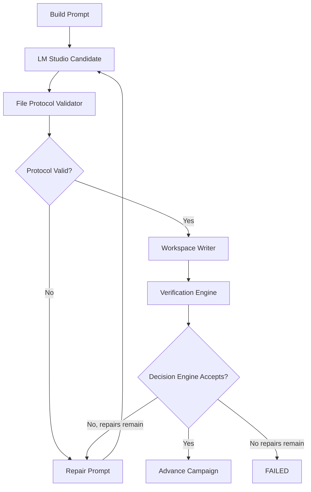

# Campaign Runner Architecture

Campaign Runner owns execution. LM Studio only generates candidate artifacts.

## Builder Protocols

Two protocols are supported, selected by `execution_policy.json` (`builderProtocol`, default `FILE_JSON`):

- `FILE_JSON` (default): the request includes an OpenAI-compatible `response_format: json_schema` so the model must return `{"files":[{"path","content"}]}`. Validated by `validateJsonFileProtocol` in `app/lib/file-protocol-validator.ts`, which shares path normalization with the legacy validator, deterministically unescapes double-escaped newlines (`UNESCAPE_DOUBLE_ESCAPED_CONTENT`), and falls back to `FILE:` block parsing when the response is not valid JSON.
- `FILE_BLOCKS` (legacy): `FILE: relative/path` text blocks, unchanged.

Requests also pass `reasoning_effort` from settings (tuned for gpt-oss-120b).

## Workspace Context

`app/lib/workspace-context.ts` injects a token-budgeted view of the existing workspace into every builder prompt: a file tree plus the contents of the current task's declared `Workspace Output` paths, its dependencies' outputs, and project manifests, newest-first for the remainder. Budget comes from `settings.contextTokens` minus the task body. Empty workspaces produce no section.

## Autonomous Window Mode

`runAutonomousWindow` in `app/lib/runner.ts` (invoked via `POST /api/run` with `mode: "window"`) loops until `settings.windowEnd` (HH:MM, next occurrence), completing the in-flight task at the boundary. Hard failures (e.g. LM Studio unreachable) retry with 30s backoff and abort the window after 3 consecutive occurrences. Every window emits `RUN_WINDOW_STARTED` / `RUN_WINDOW_COMPLETED` log events with an end-of-window summary.

## Task Reports and Campaign Memory

The FILE_JSON schema requires a `report` object (`status`, `notes`, `blockers`, `followUps`) alongside `files`. Sanitized reports are persisted per task to `campaign_memory.json` (`app/lib/campaign-memory.ts`) on every terminal outcome — VERIFIED, DEFERRED, or FAILED (failure reasons are folded into notes/blockers). The most recent entries are rendered into each builder prompt (budgeted at ~2,500 tokens, oldest dropped first) so decisions and discoveries travel forward across tasks and deferral retry rounds. Reports also land on `ExecutionRecord.report` for artifacts.

## Truncation Handling and Repair Escalation

`lm-studio.ts` returns `{content, truncated}` using the response `finish_reason`. A truncated attempt logs `GENERATION_TRUNCATED`, doubles the output token budget for subsequent attempts (capped at 65,536), and tells the repair prompt the response was cut off rather than malformed. Repair attempts always run at temperature 0 with reasoning effort high, regardless of first-attempt settings.

## Declared-Output Verification

With `enforceDeclaredOutputs: true` (default), `checkDeclaredOutputs` in `app/lib/verification-engine.ts` verifies that every concrete path under the task's `Workspace Output` exists after files are written, surfacing a synthetic "Declared Outputs" verifier result. A missing declared file blocks acceptance and routes through the normal repair loop (`DECLARED_OUTPUTS_MISSING` event).

## Git Checkpointing

With `gitCheckpoints: true` (default), `app/lib/workspace-git.ts` initializes a standalone git repository inside the workspace (baseline commit, local identity, `.gitignore` covering runner diagnostics), commits after every VERIFIED task, and rolls back (`checkout -- . && clean -fd`) when a task fails or defers — so a failed task's partial files never pollute later tasks. Git is best-effort: errors log `GIT_ERROR` and never fail a task.

## Speculative Generation

With `speculativeGeneration: true` (default), while task N verifies on CPU the engine fire-and-forgets a generation for the predicted next task (`launchSpeculation` in `app/lib/execution-engine.ts`), predicting the post-accept memory and reading the already-written workspace. The result is reused only when the next run's prompt + sampling params hash exactly matches (`app/lib/speculation.ts`); any divergence — failed verification, rollback, checkpoint amendment, settings change — is an automatic miss. Events: `SPECULATION_STARTED`, `SPECULATION_HIT`.

## Executable Checkpoints (Bounded Re-planning)

With `checkpointsEnabled: true` (default), the runner executes campaign checkpoints as first-class stages (`app/lib/checkpoint-engine.ts`): checkpoint i is due once `i × Checkpoint Interval` tasks are complete, and the due check runs before the campaign-complete check so a final review can extend a finished campaign. The model reviews plan-vs-workspace under a strict amendment schema and may only `add` tasks (appended, capped at +20% per checkpoint) or `revise` not-yet-completed tasks. Amendments are validated (`validateCampaignPrompts` on the merged plan) before prompt files / `campaign.json` / `taskGraph.json` are updated; anything invalid is discarded and logged. Results persist to `checkpoints/checkpoint_NN.json`, `history.completedCheckpoints`, and campaign memory. The campaign goal is fixed; only the path may bend, and every bend is validated and auditable.

## Preflight and Nightly Scheduling

Window runs begin with `preflightLmStudio` (`app/lib/lm-studio-preflight.ts`): server reachable (auto `lms server start`), model present, model loaded (auto `lms load`), and a one-token generation probe — failures abort the window with `PREFLIGHT` log events. `scripts/autonomous-window.sh` plus `scripts/com.campaignrunner.window.plist` provide the launchd wiring: fire at `windowStart`, ensure the production server is up, and run the window under `caffeinate` so the Mac cannot sleep mid-campaign. Wake-from-sleep needs a one-time `sudo pmset repeat wakeorpoweron`.

## Skip and Defer

With `execution_policy.json` `deferOnFailure: true` (default), a task that exhausts its repair budget is recorded in `history.deferredSteps` instead of stopping the campaign, and execution advances to the next task whose `Depends On` set is satisfied (`nextEligibleStep` in `app/lib/execution-engine.ts`). When only deferred tasks remain, window mode clears them and retries with a fresh repair budget for up to `maxDeferralRounds` rounds. Events: `TASK_DEFERRED`, `DEFERRAL_ROUND_STARTED`.

## Execution Engine

File: `app/lib/execution-engine.ts`

Public interface:

```ts
executeNextHour(projectRoot: string): Promise<RunResult>
```

Flow:



Example log lines:

```text
[2026-06-25T08:00:00.000Z] PROMPT_BUILT: Hour 01 prompt hash abc123.
[2026-06-25T08:00:05.000Z] PROTOCOL_REJECTED: Model response did not include any FILE: relative/path blocks.
[2026-06-25T08:00:20.000Z] CAMPAIGN_ADVANCED: Hour 01 VERIFIED. Advanced to 2.
```

## Decision Engine

File: `app/lib/decision-engine.ts`

Public interface:

```ts
decisionEngine.shouldAdvance(results, protocol, contract)
decisionEngine.shouldRetry(attempt, maxAttempts, errorCode)
decisionEngine.shouldRepair(repairAttempt, contract, protocol, results)
decisionEngine.shouldFail(repairAttempt, contract, protocol, results)
decisionEngine.shouldCheckpoint()
decisionEngine.shouldAccept(results, protocol, contract)
decisionEngine.shouldRunVerifier(step, workspaceFiles, contract)
```

All accept/repair/fail/verifier decisions route through this module.

## Execution Contract

File: `app/lib/execution-contract.ts`

Example:

```json
{
  "builderProtocol": "FILE_BLOCKS",
  "verifierPipeline": [
    {
      "name": "Files Exist",
      "enabled": true,
      "command": "test -n \"$(find . -type f -not -name '.*' | head -1)\"",
      "timeoutSeconds": 20,
      "continueOnFailure": false
    }
  ],
  "acceptancePolicy": {
    "acceptOnlyVerified": true
  },
  "repairPolicy": {
    "maxRepairAttempts": 3
  },
  "workspacePolicy": {
    "maturity": "EMPTY"
  }
}
```

The contract is built from `execution_policy.json`, the Generic campaign profile, and workspace maturity.

## Builder Protocol

File validator: `app/lib/file-protocol-validator.ts`

Only this output format is supported:

```text
FILE: relative/path
complete file contents

FILE: another/path
complete file contents
```

Invalid examples:

```text
Here is the code:
~~~ts
console.log("missing FILE header")
~~~
```

Structured validation result:

```json
{
  "valid": false,
  "files": [],
  "errors": [
    {
      "code": "NO_FILE_BLOCKS",
      "message": "Model response did not include any FILE: relative/path blocks."
    }
  ]
}
```

## Workspace Writer

File: `app/lib/workspace-writer.ts`

Writes only protocol-valid files under `workspace/`. Protocol-invalid output is saved as a rejected response for diagnosis and never accepted as successful work.

## Verification Engine

File: `app/lib/verification-engine.ts`

Runs enabled verifier commands sequentially in the workspace. Captures:

```json
{
  "verifier": "Typecheck",
  "status": "PASS",
  "command": "npm run typecheck",
  "stdout": "",
  "stderr": "",
  "exitCode": 0,
  "runtimeSeconds": 8.2,
  "timedOut": false
}
```

Verifier applicability is determined by the Decision Engine and workspace maturity. Empty workspaces use file-existence verification instead of build/typecheck.

## Repair Engine

File: `app/lib/repair-engine.ts`

Repair prompts include only:

```text
Task:
Fix Hour 01 in workspace /Project/workspace.

Previous attempt summary:
Protocol rejected: Model response did not include any FILE blocks.

Verification Output:
No verifier output.

Protocol violations:
- Model response did not include any FILE: relative/path blocks.

Files requiring repair:
Files from the failed attempt or newly required files.

Return instructions:
Fix ONLY the issues listed.
Return ONLY modified files using this exact Builder Protocol:
FILE: relative/path
<complete file contents>
```

## State Machine

File: `app/lib/execution-state.ts`

States:

```text
READY -> RUNNING -> WRITING_FILES -> VERIFYING -> COMPLETE
READY -> RUNNING -> WRITING_FILES -> REPAIRING -> WRITING_FILES -> VERIFYING
VERIFYING -> FAILED
FAILED -> READY
```

State is persisted in `execution_state.json`.

## Runtime JSON Validation

File: `app/lib/runtime-validation.ts`

Validated files:

```text
history.json
execution_state.json
execution_policy.json
metrics.json
campaign_summary.json
```

Malformed runtime files are rejected or routed into recovery rather than silently trusted.

## LM Studio Client

File: `app/lib/lm-studio.ts`

Detects:

```text
SERVER_UNAVAILABLE
MODEL_UNLOADED
TIMEOUT
INVALID_JSON
EMPTY_RESPONSE
HTTP_ERROR
```

Requests use timeout and retry values from `settings.json`.
